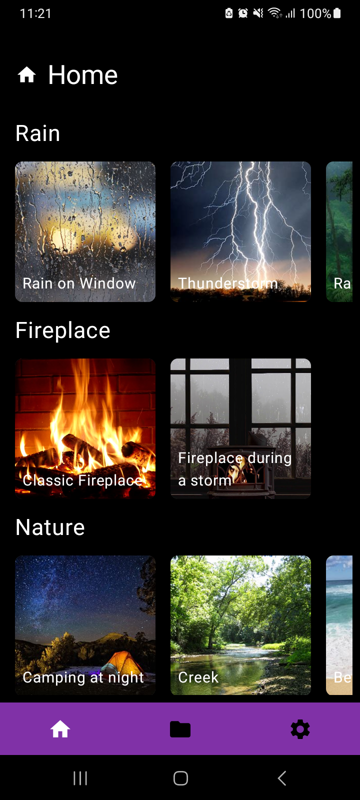
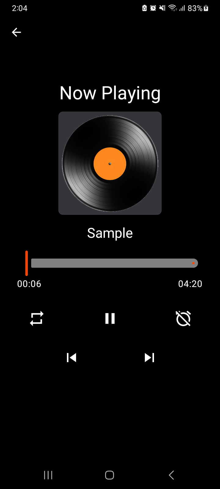
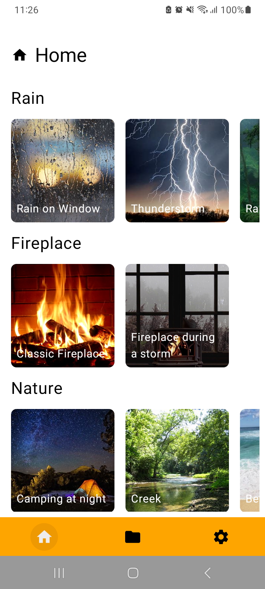
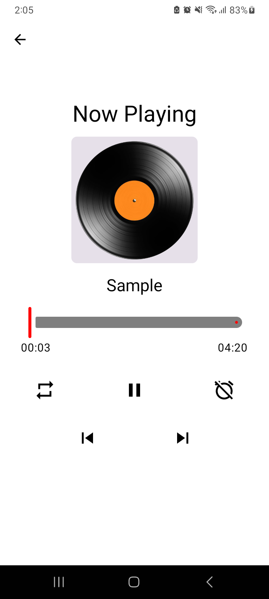

# Project - Specialized Topics (Niên luận chuyên ngành) - CT501H

  

Sleep Assistance Sound Player - A simple sound player to help users fall asleep created with Jetpack Compose and MediaPlayer

## Preview

|  |  |  |  |
|---------------------------------|:-------------------------------------:|:--------------------------------:|:--------------------------------------:|

## Tech stack

- [Kotlin]([https://kotlinlang.org/](https://kotlinlang.org/)) 
- [Jetpack]([https://developer.android.com/jetpack](https://developer.android.com/jetpack))
  - [Compose]([https://developer.android.com/jetpack/compose](https://developer.android.com/jetpack/compose)) - Modern native UI toolkit.
  - [Navigation]([https://developer.android.com/jetpack/compose/navigation](https://developer.android.com/jetpack/compose/navigation)) - Handle in-app navigation.
  - [DataStore]([https://developer.android.com/topic/libraries/architecture/datastore](https://developer.android.com/topic/libraries/architecture/datastore)) - For storing theme and language preferences.
- [Room Database]([https://developer.android.com/training/data-storage/room](https://developer.android.com/training/data-storage/room)) - Persistence library providing an abstraction layer over SQLite.
- [MediaPlayer]([https://developer.android.com/guide/topics/media/mediaplayer](https://developer.android.com/guide/topics/media/mediaplayer)) - Android's built-in media playback framework.
- [Coroutines]([https://kotlinlang.org/docs/reference/coroutines-overview.html](https://kotlinlang.org/docs/reference/coroutines-overview.html)) - For asynchronous operations and concurrency.

## Features

* **Sound Playback:**
    * Preloaded audio files.
    * Local audio files from the user's device.
* **Timer:** Set a timer to stop playback and optionally turn off the app or device.
* **Background Music:** Background music playback functionality.
* **Settings:** Change theme, language, access the about page.

